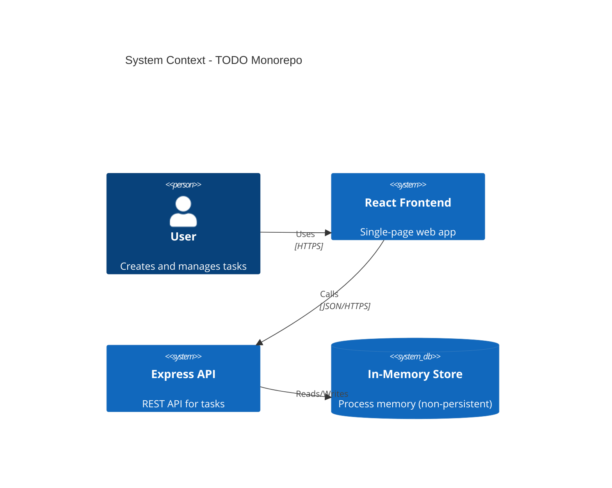
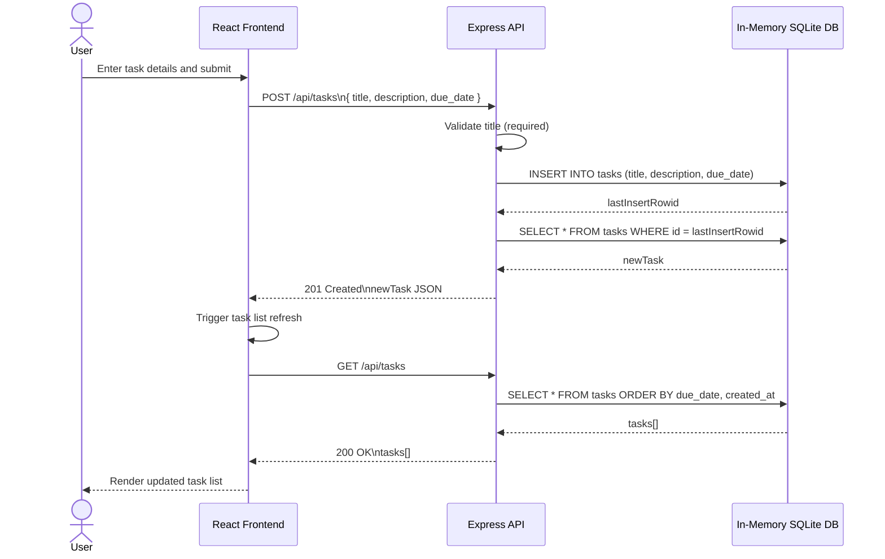

# Cloud architecture overview

This document provides a simple **system context** view of the TODO application in this monorepo.

```mermaid
C4Context
title System Context - TODO Monorepo

Person(user, "User", "Creates and manages tasks")

System(frontend, "React Frontend", "Single-page web app")
System(api, "Express API", "REST API for tasks")
SystemDb(store, "In-Memory Store", "Process memory (non-persistent)")

Rel(user, frontend, "Uses", "HTTPS")
Rel(frontend, api, "Calls", "JSON/HTTPS")
Rel(api, store, "Reads/Writes")
```

## Sequence: Create a TODO

```mermaid
sequenceDiagram
	actor U as User
	participant FE as React Frontend
	participant API as Express API
	participant DB as In-Memory SQLite DB

	U->>FE: Enter task details and submit
	FE->>API: POST /api/tasks\n{ title, description, due_date }
	API->>API: Validate title (required)
	API->>DB: INSERT INTO tasks (title, description, due_date)
	DB-->>API: lastInsertRowid
	API->>DB: SELECT * FROM tasks WHERE id = lastInsertRowid
	DB-->>API: newTask
	API-->>FE: 201 Created\nnewTask JSON
	FE->>FE: Trigger task list refresh
	FE->>API: GET /api/tasks
	API->>DB: SELECT * FROM tasks ORDER BY due_date, created_at
	DB-->>API: tasks[]
	API-->>FE: 200 OK\ntasks[]
	FE-->>U: Render updated task list
```
